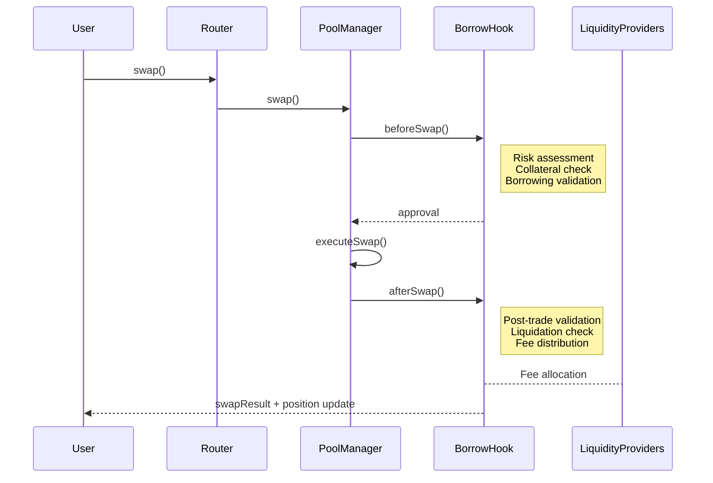
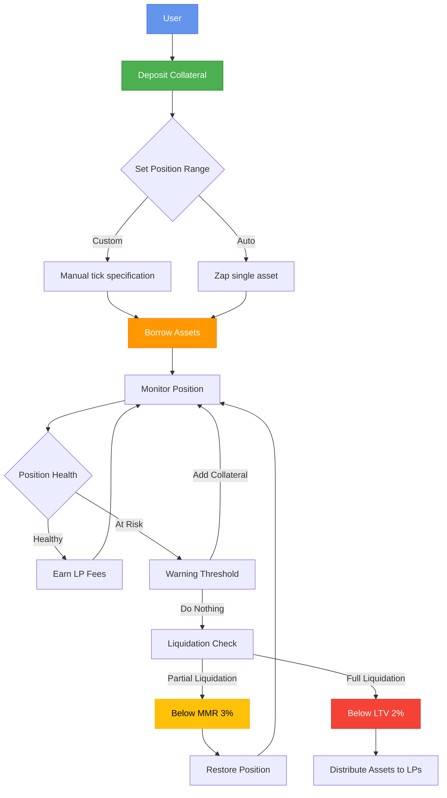
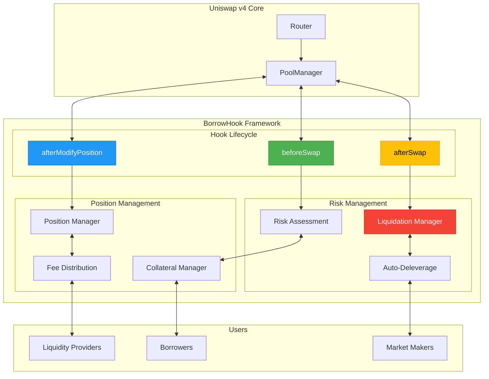
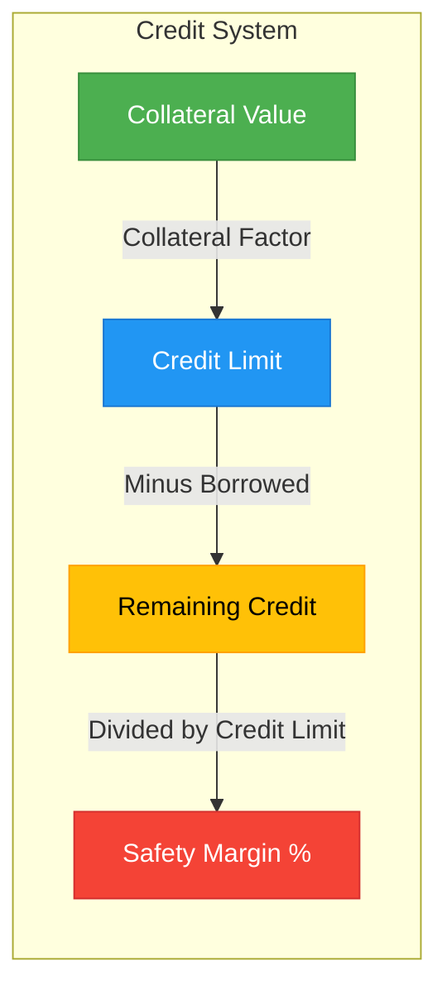
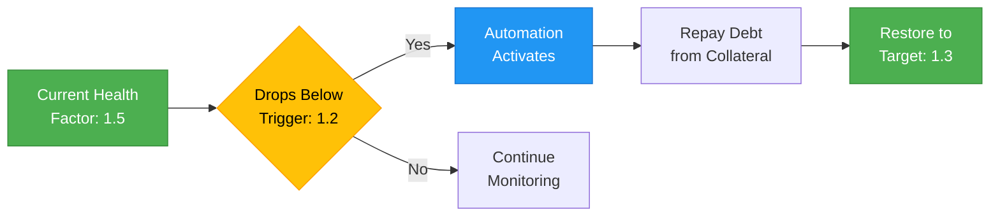

# Dex Mini Borrow Hook v4

<div align="center">

[![Foundry][foundry-badge]][foundry-url] [![Uniswap v4][uniswap-badge]][uniswap-url] [![License: MIT][license-badge]][license-url]


**Advanced Lending & Borrowing with Concentrated Liquidity**

</div>

## 📑 Overview

Dex Mini is innovative Borrow Hook empowers both retail and institutional users with unprecedented control over on-chain liquidity. Built on Uniswap v4, our protocol redefines DeFi lending by integrating concentrated liquidity with institutional-grade risk management.



## 🚀 Key Features

<div align="center">

| Feature | Description |
|---------|-------------|
| 📈 **Precision Liquidity** | Deploy collateral within custom ranges with up to 95% LTV against ETH |
| 💸 **Optimized Fee Generation** | Maximize returns from concentrated liquidity to offset borrowing costs |
| 🔄 **Cross-Pool Flexibility** | Deposit in one pool and borrow from another for advanced strategies |
| 🔌 **Built-in Zap** | Convert single-asset deposits into dual-token liquidity effortlessly |
| 🛡️ **Auto-Deleverage** | Intelligent system for dynamic debt/collateral ceiling adjustments |
| ⚡ **Advanced Liquidation** | Robust two-tiered liquidation system for optimal risk management |
| 🧠 **Oracle-Free Design** | Minimized reliance on external data feeds for enhanced security |

</div>

## 🌐 User Journey



## 🔧 Hook Integration Architecture



## 💻 Core Functions

```solidity
// Position creation
function createBorrowPosition(
    PoolKey memory key,
    int24 tickLower,
    int24 tickUpper,
    uint256 collateralAmount,
    uint256 borrowAmount
) external returns (uint256 positionId) {
    // Validate position parameters
    require(borrowAmount <= getMaxBorrowAmount(collateralAmount, key), "Exceeds max LTV");
    
    // Setup collateral and position
    poolManager.modifyPosition(
        key, 
        IPoolManager.ModifyPositionParams({
            tickLower: tickLower,
            tickUpper: tickUpper,
            liquidityDelta: collateralAmount.toInt256()
        }),
        abi.encode(BorrowParams({
            borrowAmount: borrowAmount,
            recipient: msg.sender
        }))
    );
    
    // Return the new position ID
    return nextPositionId++;
}
```

## 📊 Credit Management

<div align="center">



</div>

### Understanding Your Credit

| Metric | Formula | Example |
|--------|---------|---------|
| **Credit Limit** | Collateral × Collateral Factor | $1,000 USDC × 60% = $600 |
| **Remaining Credit** | Credit Limit - Borrowed Amount | $600 - $100 = $500 |
| **Safety Margin** | (Remaining Credit / Credit Limit) × 100% | ($500 / $600) × 100% = 83.3% |

> ⚠️ **Critical Risk:** A Safety Margin of 0% puts your position at immediate risk of liquidation.

## 🛡️ Liquidation & Risk Management

Dex Mini employs a sophisticated two-tiered liquidation system with proactive risk mitigation tools:

### Liquidation Thresholds

| Threshold | Trigger | Action |
|-----------|---------|--------|
| **MMR (3%)** | Position equity < 3% | Partial liquidation to restore margin |
| **Full Liquidation (2%)** | Position equity < 2% | Complete liquidation & asset distribution |

### Automated Position Protection



## 💰 Fee Structure

<div align="center">

| Fee Type | Rate | LP Share | Protocol Share | EigenLayer Operator |
|----------|------|----------|----------------|---------------------|
| **Liquidity Management** | 0.25% | 70% | 0% | 30% |
| **Trading** | Variable | 90% | 10% | 0% |
| **Deposit & Withdraw** | 0.25% | 70% | 30% | 0% |
| **Borrowing** | 0.1-100% APY | 100% | 0% | 0% |
| **Liquidation Penalty** | 0.2% | 70% | 30% | 0% |

</div>

## 🔐 Security & Transparency

- ✅ Rigorous smart contract audits
- ✅ Comprehensive bug bounty program
- ✅ Multi-layered risk mitigation
- ✅ Real-time monitoring systems

> ⚠️ **Note:** DeFi carries inherent risks. Always conduct due diligence before participating.

## 📦 Installation

```bash
# Clone the repository
git clone https://github.com/dex-mini/borrow-hook-v4.git
cd borrow-hook-v4

# Install dependencies
forge install

# Build the project
forge build
```

## 🧪 Testing

```bash
# Run all tests
forge test -vvv

# Run specific test suite
forge test --match-contract BorrowHookTest -vvv

# Run with gas reporting
forge test --gas-report
```

## 📚 Usage Examples

### Creating a Borrow Position

```solidity
// Set up position parameters
address token0 = WETH;
address token1 = USDC;
int24 tickLower = -100;
int24 tickUpper = 100;
uint256 collateralAmount = 10 ether;
uint256 borrowAmount = 15000 * 10**6; // 15,000 USDC

// Approve token transfer
IERC20(token0).approve(address(borrowHook), collateralAmount);

// Create position
uint256 positionId = borrowHook.createBorrowPosition(
    PoolKey({token0: token0, token1: token1, fee: 3000}),
    tickLower,
    tickUpper,
    collateralAmount,
    borrowAmount
);
```

## 🌟 Advanced Features

- **Dynamic LTV Ratios**: Borrow up to 95% against ETH based on market conditions
- **Tick Consolidation**: Combat liquidity fragmentation through consolidated positions
- **Cross-Pool Collateralization**: Use collateral from one pool to borrow from another
- **Auto-Deleverage System**: Automatically unwind high-risk positions to prevent cascading liquidations

## 📜 License

[MIT License](LICENSE)

---

<div align="center">

**Stay agile, monitor wisely, and leverage responsibly to maximize your DeFi potential.**

[Website](https://dexmini.com) • [Docs](https://docs.dexmini.com) • [Twitter](https://twitter.com/dexmini)

</div>

[foundry-badge]: https://img.shields.io/badge/Built%20with-Foundry-FF8000?style=flat-square
[foundry-url]: https://getfoundry.sh
[uniswap-badge]: https://img.shields.io/badge/Powered%20by-Uniswap%20v4-FF007A?style=flat-square
[uniswap-url]: https://uniswap.org
[license-badge]: https://img.shields.io/badge/License-MIT-blue.svg?style=flat-square
[license-url]: https://opensource.org/licenses/MIT
